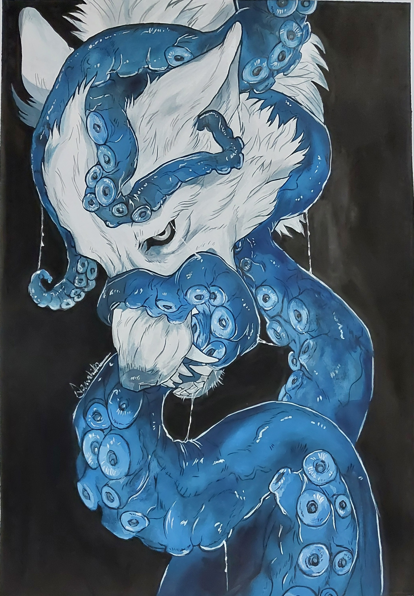
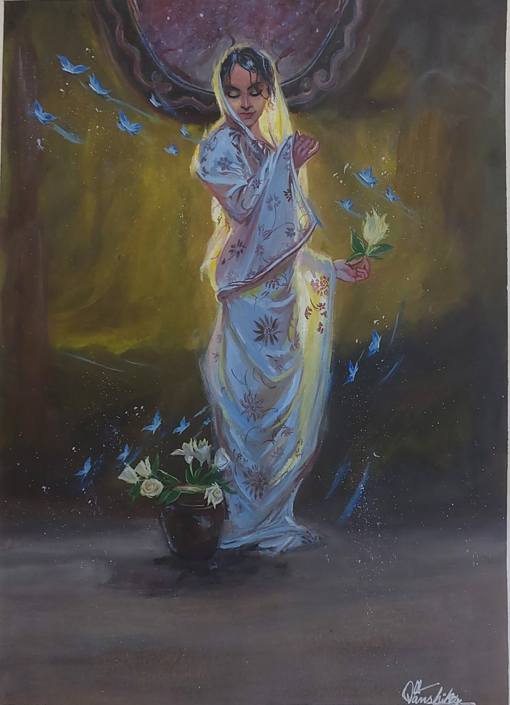
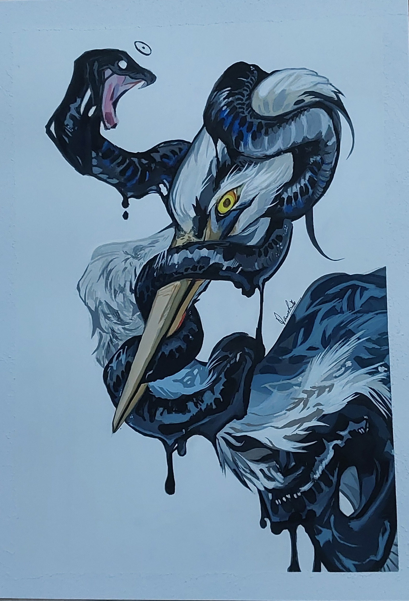

<div align="center">

# 🖋️ The Ink Flow Gallery
### *Where BCA Technicality meets Creative Expression*

[](https://github.com/vanshikaverma7202-ux/Digital-Art-portfolio-/stargazers)
[](https://opensource.org/licenses/MIT)

[**✨ View Live Site**](https://vanshikaverma7202-ux.github.io/Digital-Art-portfolio-/)

---

**A digital sanctuary showcasing a fusion of code and canvas.** This project serves as my professional digital portfolio, hosting a curated collection of surrealist sketches, ballpoint pen art, and original poetry.

[Explore the Gallery](#-gallery-preview) • [Technical Stack](#-tech-stack) • [Artistic Vision](#-about-the-artist)

</div>

## 🎨 Project Overview
The **Ink Flow Gallery** is more than just a website; it is an experiment in front-end development designed to present traditional art in a modern, responsive digital environment. 

* **Total Artworks:** 36 Original Pieces
* **Mediums:** Ballpoint Pen, Surrealist Sketching, Acrylics
* **Bonus Content:** Original Poetry Collection

## 🛠️ Tech Stack
To build this bridge between art and technology, I utilized:

* **Frontend:** HTML5, CSS3 (Custom Grid Layouts)
* **Interactivity:** JavaScript for gallery filtering and lightboxes
* **Version Control:** Git & GitHub

## ✨ Gallery Preview
> *"Every stroke of the pen is a line of code in the story of my imagination."*

> ## 📸 Gallery Sneak Peek
<div align="center">
  
  
  
</div>

* **Surrealism:** Exploring the subconscious through detailed sketching.
* **The Ink Series:** Mastery of the ballpoint pen as a high-detail medium.
* **Verses:** A dedicated section for written word and emotional expression.

## 🚀 Getting Started
To view the portfolio locally:
1. Clone the repository:
   ```bash
   git clone [https://github.com/vanshikaverma7202-ux/Digital-Art-portfolio-.git](https://github.com/vanshikaverma7202-ux/Digital-Art-portfolio-.git)

 ## 📬 Connect with Me
 **Instragram art account:** [@familia_creation]

   
